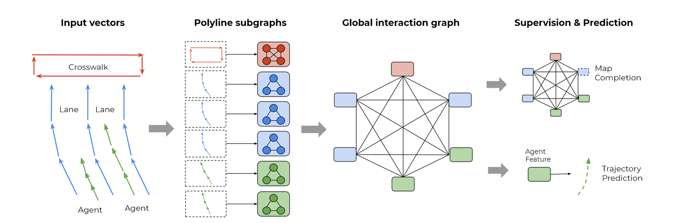

# VectorZoo

VectorNet Encoder-based Motion Forecasting Algorithm Replication Projects 

## VectorNet Encoder   

TODO 

## TNT Decoder 

- Anchor-based Method 

## Dense TNT Decoder 

- Heatmap-based Method  

## Tree 
- Config TODO 
    - MMdetection Style 
